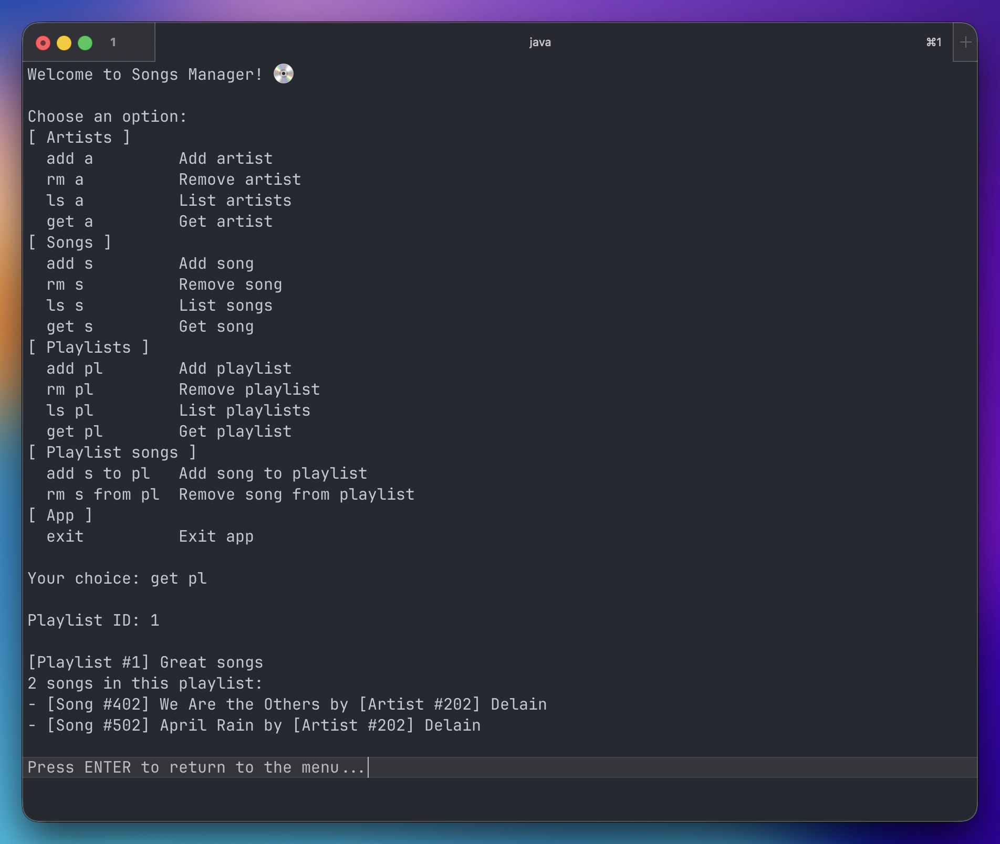

# Songs Manager

Songs Manager is a CLI application that allows you to manage songs, artists, and playlists. First and foremost, this is a playground and reference project I use to try and document how to configure and use Hibernate on its own. On its own the application serves no real purpose, though.



## Setup

Setup project after cloning repository.

### System requirements

- Java/JDK (tested with OpenJDK 25)
- Maven (tested with 3.9)

### Configure database connection

Copy `/persistence.properties.example` to `/persistence.properties` and fill out all required values. The file contains comments for guidence.

## Run app

``` shell
mvn clean compile
mvn -q exec:java -Dexec.mainClass="dev.alinnert.songsmanager.SongsManager"
```
